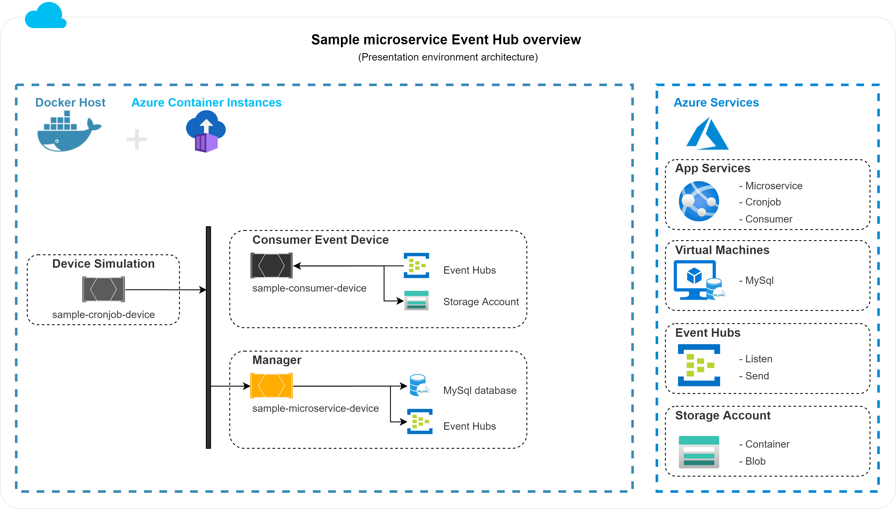

# Sample - Microservice Device
[](https://dev.azure.com/NerdAllDebug/PalestraMVP/_build/latest?definitionId=1&branchName=master)

Criado como um exemplo prático, este microsserviço envia eventos para o Event Hub da Microsoft quando feito uma chamada POST no endpoint ***api/manager***.

Macro função:

1. Enviar uma mensagem para a fila do Event Hub.

## Visão geral macro para esse microsservice



### Enviar uma mensagem para a fila do Event Hub

Receber um estímulo via HTTP POST, enviando assim a mensagem para o Event Hub.
\
_Configuração do Event Hub [clique aui](#event-hub)_

## Configuration
Usando o design pattern options, as configurações são gravadas no arquivo de configuração ***appsettings.json***.
\
Seguem as configurações para cada seção do arquivo de configuração:

### ConnectionStrings
Esse microservice usa o MySql como banco de dados.
\
Nesta seção você deve colocar a connectionstring que corresponde ao MySql.
```json
{
  "ConnectionStrings": {
    "DefaultConnectionConfiguration": "MySql ConnectionString"
  }
}
```
### Globalization
Por padrão, a globalização do microservice está em inglês.
```json
{
  "Globalization": {
    "DefaultEnvironmentCulture": "en-US",
    "DefaultRequestCulture": "en-US",
    "SupportedCultures": [ "en-US", "pt-BR" ],
    "SupportedUICultures": [ "en-US", "pt-BR" ]
  }
}
```
### Host
O Host representa a identificação do microservice, importante para a rastreabilidade e segurança das APIs.
* ApplicationHost: endereço onde o microservice está hospedado;
* ApplicationName: nome do microservice;
* AuthorizationToken: GUID gerado para limitar o acesso ao microsserviço. Os ambientes têm tokens diferentes, portanto, para acessar as APIs, você precisará obter o token do ambiente que está acessando.
```json
{
  "Host": {
    "ApplicationHost": "https://sample-microservice-device.azurewebsites.net/",
    "ApplicationName": "Sample - Microservice Device",
    "AuthorizationToken": "c71310fa00d949368c7e845fbdb641b6"
  }
}
```

### Logs
Todas as aplicações devem ter logs registrados no Repositório de Log. Aqui temos a seção de log, *Erro*.
```json
{
  "Logs": {
    "Error": {
	}
  }
}
```
#### Error
O log de erros é capturado automaticamente pelo host e enviado ao Repositório de Log sempre que o microservice lança uma exceção.
* ViewDetailsOnResponse: true para exibir o erro na resposta da API, caso contrário, false. 
```json
{
  "Logs": {
    "Error": {
      "ViewDetailsOnResponse": true
    }
  }
}
```

### Event Hub
Configurações do producer ou consumer do event hub.

#### Producers
As configurações para enviar objetos ao event hub.
* Name: nome que identifica o producer na injeção de dependência;
* ConnectionString: conexão do producer;
* EventHubName: nome que identifica o event hub na nuvem.
```json
{
  "EventHubs": {
    "Producers": [
      {
        "Name": "TransactionFlow",
        "ConnectionString": "Endpoint=<ENDPOINT>;SharedAccessKeyName=<SHARED_ACCESS_KEY_NAME>;SharedAccessKey=<SHARED_ACCESS_KEY>;EntityPath=<ENTITY_PATH>",
        "EventHubName": "<EVENT_HUB_NAME>"
      }
    ]
  }
}
```

## API REST
Para ver o release pipeline [clique aqui](https://dev.azure.com/NerdAllDebug/PalestraMVP/_release?_a=releases&view=mine&definitionId=1).

#### Apresentação 
* [](https://vsrm.dev.azure.com/NerdAllDebug/_apis/public/Release/badge/98c93b17-e3bd-4372-97ce-9b2b54909071/1/1)
* Para ver a documentação swagger [clique aqui](https://sample-microservice-device.azurewebsites.net/swagger/index.html).
